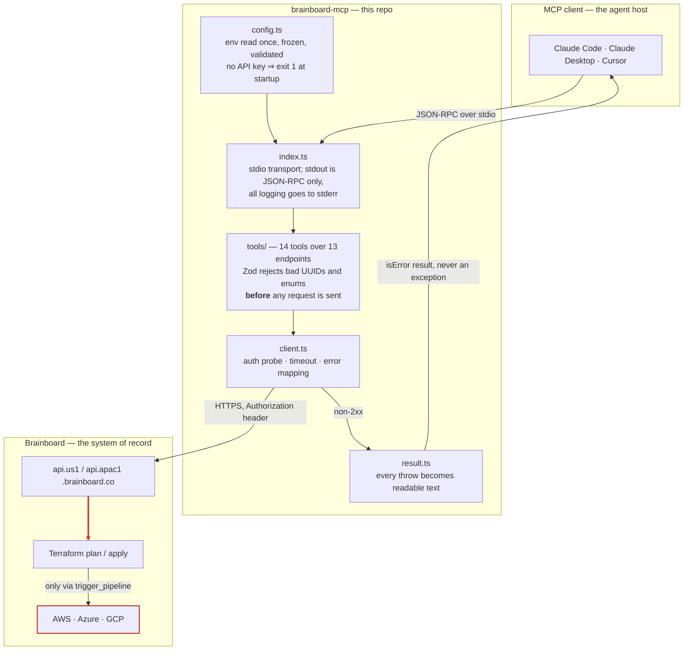

# Brainboard MCP

An unofficial [MCP](https://modelcontextprotocol.io) server that puts
[Brainboard](https://www.brainboard.co/) — a visual cloud-architecture tool that generates Terraform
from a diagram — behind a tool interface an AI agent can drive. It turns *"clone the AWS three-tier
template into staging, set the region to `eu-west-1`, and run the plan"* into real API calls, a real
diagram, and real generated Terraform.

[](https://www.npmjs.com/package/brainboard-mcp)
[](LICENSE)

> **Unofficial.** Built against Brainboard's public API and published OpenAPI spec, not by
> Brainboard. "Brainboard" is their trademark.

**Links** — [npm package](https://www.npmjs.com/package/brainboard-mcp) ·
[server README + tool reference](brainboard-mcp/README.md) ·
[API findings](brainboard-mcp/docs/API-FINDINGS.md)

## Install

Published to npm as **[`brainboard-mcp`](https://www.npmjs.com/package/brainboard-mcp)**. There is
nothing to deploy — it is a stdio server that your MCP client launches as a child process.

```bash
claude mcp add brainboard npx brainboard-mcp --env BRAINBOARD_API_KEY=<your-key>
```

Or wire it up by hand, in any MCP client:

```jsonc
{
  "mcpServers": {
    "brainboard": {
      "command": "npx",
      "args": ["-y", "brainboard-mcp"],
      "env": { "BRAINBOARD_API_KEY": "<your-key>" }
    }
  }
}
```

Then ask the agent to run `brainboard_check_connection`. Full configuration, the 14-tool reference,
and a Windows `.cmd`-shim workaround are in **[brainboard-mcp/README.md](brainboard-mcp/README.md)**.

## Architecture



The red edge is the only path to irreversible effect. Everything above it is metadata; below it,
`terraform apply` runs against live cloud accounts.

## Stack

| | |
| --- | --- |
| Language | TypeScript 5.9, `strict` + `noUncheckedIndexedAccess`, ES2022 / Node16 modules |
| Runtime | Node.js ≥ 18, native `fetch` and `FormData` — no HTTP library |
| Protocol | `@modelcontextprotocol/server` v2, stdio transport |
| Validation | Zod v4, at the tool boundary |
| Tests | Vitest 4, `fetch` stubbed — no network, no key |
| CI | GitHub Actions, Node 20 + 22 matrix |
| Distribution | npm, [`brainboard-mcp`](https://www.npmjs.com/package/brainboard-mcp) |
| Dependencies | 2 runtime, 3 dev |

## Local setup

```bash
git clone https://github.com/smitp1402/Brainboard.git
cd Brainboard/brainboard-mcp
npm ci
npm run typecheck && npm test && npm run build
```

**No API key is needed for any of that.** The test suite stubs `fetch` entirely, so typecheck, test
and build run offline. You only need a key to talk to the live API — and Brainboard's free tier
issues one from organization settings, so there is no paid dependency at any point in this project.

To point a client at your working copy rather than the published package, use the built entrypoint
directly — `brainboard-mcp/.env.example` documents every variable:

```bash
claude mcp add brainboard node "$PWD/dist/index.js" --env BRAINBOARD_API_KEY=<your-key>
```

`brainboard_check_connection` then reports the resolved base URL and which `Authorization` form your
account accepted.

## Tests

```bash
cd brainboard-mcp
npm test              # 16 tests, 2 files, ~900ms
npm run test:watch
```

Coverage is deliberately uneven, and the shape is worth stating: `config.ts` and `client.ts` are
where the non-obvious behaviour lives — auth fallback, scheme pinning, the no-retry-on-non-auth
rule, timeout-to-408 mapping, empty-204 handling — so they are tested directly with `fetch` stubbed.
The tool modules are thin delegation over that client and are not unit-tested; they were verified
against the live API instead, and the results are in the
[per-tool verification table](brainboard-mcp/README.md#verification-status).

## CI/CD

[`.github/workflows/ci.yml`](.github/workflows/ci.yml) runs typecheck, tests and build on Node 20
and 22 for every push to `main` and every PR.

The part worth calling out is the last step. After building, CI executes the real entrypoint with no
`BRAINBOARD_API_KEY` set and asserts two things: that it exits `1`, and that its stderr mentions
`BRAINBOARD_API_KEY`. That catches the failure mode unit tests structurally cannot — a broken
shebang, a bad `bin` mapping, or an ESM resolution error in the compiled output. All of those ship a
green test suite and a package that dies on launch inside someone's MCP client, where the only
symptom is "server not connected" with no error text. `prepublishOnly` runs typecheck, test and
build again, so a broken tarball cannot reach npm.

There is no automated release step; publishing is manual.

## Known limitations

- **`import_variables` does not work.** `POST /variables/import/{uuid}` returns `INVALID_BODY` for
  every documented request shape — twenty combinations tried, never the spec's distinct
  `MISSING_FILE_UPLOAD`. Something required is unpublished. The tool ships with `file_field` and
  `extra_fields` escape hatches so it works the moment Brainboard clarifies; until then use
  `variable_values` on the clone tools, which does.
  [Full evidence](brainboard-mcp/docs/BUG-import-variables.md).
- **`trigger_pipeline` has never been run end-to-end.** It can `terraform apply` against real cloud
  accounts, so it was left untested on purpose. It carries `destructiveHint: true` and is built from
  the spec and the surrounding verified endpoints — but "built correctly" is not "verified", and it
  is listed as unverified rather than quietly counted as passing.
- **Responses are trusted, not validated.** Input is strictly checked by Zod; output is parsed as
  JSON and handed to the model untyped. The list endpoints are consumed whole, so if Brainboard
  changes a response shape or adds pagination, this server passes it straight through.
- **Ceiling set by the API, not by this server:** no node-level diagram editing (you clone and
  configure architectures, you do not place individual resources) and no way to fetch the generated
  Terraform back out.

## License

MIT — see [LICENSE](LICENSE).
