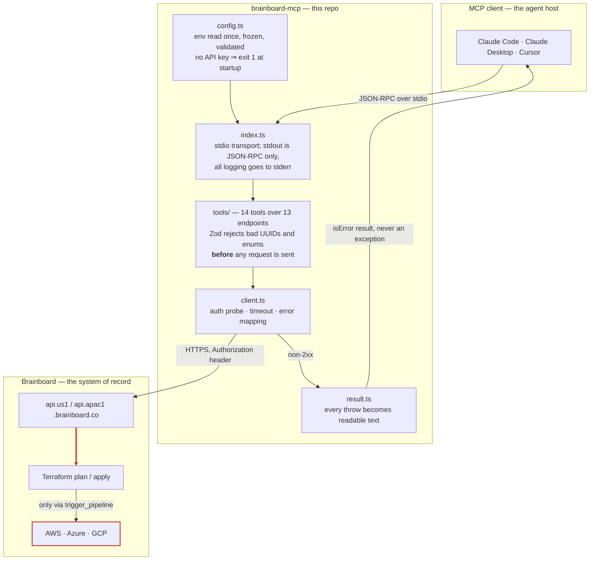

# Brainboard MCP

An unofficial [MCP](https://modelcontextprotocol.io) server that puts
[Brainboard](https://www.brainboard.co/) — a visual cloud-architecture tool that generates Terraform
from a diagram — behind a tool interface an AI agent can drive. It turns *"clone the AWS three-tier
template into staging, set the region to `eu-west-1`, and run the plan"* into real API calls, a real
diagram, and real generated Terraform.

[](https://www.npmjs.com/package/brainboard-mcp)
[](LICENSE)

> **Unofficial.** Built against Brainboard's public API and published OpenAPI spec, not by
> Brainboard. "Brainboard" is their trademark.

**Links** — [npm package](https://www.npmjs.com/package/brainboard-mcp) ·
[server README + tool reference](brainboard-mcp/README.md) ·
[API findings](brainboard-mcp/docs/API-FINDINGS.md)

## Install

Published to npm as **[`brainboard-mcp`](https://www.npmjs.com/package/brainboard-mcp)**. There is
nothing to deploy — it is a stdio server that your MCP client launches as a child process.

```bash
claude mcp add brainboard npx brainboard-mcp --env BRAINBOARD_API_KEY=<your-key>
```

Or wire it up by hand, in any MCP client:

```jsonc
{
  "mcpServers": {
    "brainboard": {
      "command": "npx",
      "args": ["-y", "brainboard-mcp"],
      "env": { "BRAINBOARD_API_KEY": "<your-key>" }
    }
  }
}
```

Then ask the agent to run `brainboard_check_connection`. Full configuration, the 14-tool reference,
and a Windows `.cmd`-shim workaround are in **[brainboard-mcp/README.md](brainboard-mcp/README.md)**.

## Architecture



The red edge is the only path to irreversible effect. Everything above it is metadata; below it,
`terraform apply` runs against live cloud accounts.

## Design decisions worth explaining

**The auth retry is gated on 401/403 — and that gate is the point.** Brainboard's spec declares
`apiKey` auth in the `Authorization` header but never says whether a `Bearer ` prefix is expected,
and their API docs page is an empty stub. Rather than guess or push the choice onto the user, the
client sends the raw key, retries once with `Bearer` on 401/403, then pins whichever worked for the
rest of the process. The non-obvious part is what it *won't* retry: a 404, a 500, or a timeout
throws immediately. A blanket retry would be reasonable for the GETs and actively dangerous for
`POST /architectures/{uuid}/clone` — the endpoint is not idempotent, so a retried "failure" that
actually succeeded server-side would create a second architecture. Auth failures are the only class
where the server is guaranteed not to have acted.
([`client.ts:64`](brainboard-mcp/src/client.ts#L64))

**Errors are returned as tool results, not thrown.** Every tool body runs through `runTool`, which
catches everything and returns `{ isError: true, content: [text] }`. Throwing would surface a
protocol-level failure the model cannot reason about or recover from; returning the failure as text
keeps it inside the conversation, where the model can act on it. So the text is written for that
reader: a 401 doesn't just say 401, it says *"check that `BRAINBOARD_REGION` matches the region your
organization is hosted in"* — which is the actual cause most of the time, because a valid key
against the wrong regional host returns 401, not 404.
([`result.ts:25`](brainboard-mcp/src/result.ts#L25))

**The Zod schemas encode findings, not the spec.** `projectRole` is `z.enum(["admin", "guest"])`.
The spec documents `Team.role` as a *response-only* field and never lists valid values; Brainboard's
own docs describe four organization roles. Nine values were probed against the live API and exactly
two were accepted. Hard-coding the empirical answer means the model gets a schema error locally
instead of burning a round trip to be told `project role is invalid`. Validation at the boundary
here is a latency and correctness decision, not a formality.
([`schemas.ts:18`](brainboard-mcp/src/schemas.ts#L18))

**No caching, deliberately.** The server holds no state between calls beyond the resolved auth
scheme — no cached project list, no UUID map. Brainboard is the system of record and humans and
other agents mutate it concurrently; a cached UUID that has since been deleted fails at the worst
possible moment, inside a multi-step plan the model has already committed to. Re-reading is cheap;
acting on a stale identifier is not.

## Stack

| | |
| --- | --- |
| Language | TypeScript 5.9, `strict` + `noUncheckedIndexedAccess`, ES2022 / Node16 modules |
| Runtime | Node.js ≥ 18, native `fetch` and `FormData` — no HTTP library |
| Protocol | `@modelcontextprotocol/server` v2, stdio transport |
| Validation | Zod v4, at the tool boundary |
| Tests | Vitest 4, `fetch` stubbed — no network, no key |
| CI | GitHub Actions, Node 20 + 22 matrix |
| Distribution | npm, [`brainboard-mcp`](https://www.npmjs.com/package/brainboard-mcp) |
| Dependencies | 2 runtime, 3 dev |

## Repo layout

```
LICENSE                     MIT
README.md                   this file
.github/
  workflows/ci.yml          typecheck · test · build · entrypoint smoke test
  dependabot.yml            grouped weekly updates
brainboard-mcp/             the published package
  README.md                 setup, full tool reference, per-tool verification status
  CHANGELOG.md
  src/
    index.ts                bootstrap, stdio transport, exit-1-on-misconfiguration
    config.ts               env parsing and validation, returns a frozen Config
    client.ts               HTTP, auth resolution, timeouts, error mapping
    result.ts               API calls → MCP tool results
    schemas.ts              shared Zod pieces mirrored from the OpenAPI spec
    tools/                  one module per resource group, 14 tools total
    *.test.ts               16 tests
  docs/
    BrainboardAPI.json      Brainboard's published OpenAPI spec — the source of truth
    API-FINDINGS.md         two spec defects found while building, with reproductions
    BUG-import-variables.md the one endpoint that cannot be called, in full
```

## Local setup

```bash
git clone https://github.com/smitp1402/Brainboard.git
cd Brainboard/brainboard-mcp
npm ci
npm run typecheck && npm test && npm run build
```

**No API key is needed for any of that.** The test suite stubs `fetch` entirely, so typecheck, test
and build run offline. You only need a key to talk to the live API — and Brainboard's free tier
issues one from organization settings, so there is no paid dependency at any point in this project.

To point a client at your working copy rather than the published package, use the built entrypoint
directly — `brainboard-mcp/.env.example` documents every variable:

```bash
claude mcp add brainboard node "$PWD/dist/index.js" --env BRAINBOARD_API_KEY=<your-key>
```

`brainboard_check_connection` then reports the resolved base URL and which `Authorization` form your
account accepted.

## Tests

```bash
cd brainboard-mcp
npm test              # 16 tests, 2 files, ~900ms
npm run test:watch
```

Coverage is deliberately uneven, and the shape is worth stating: `config.ts` and `client.ts` are
where the non-obvious behaviour lives — auth fallback, scheme pinning, the no-retry-on-non-auth
rule, timeout-to-408 mapping, empty-204 handling — so they are tested directly with `fetch` stubbed.
The tool modules are thin delegation over that client and are not unit-tested; they were verified
against the live API instead, and the results are in the
[per-tool verification table](brainboard-mcp/README.md#verification-status).

## CI/CD

[`.github/workflows/ci.yml`](.github/workflows/ci.yml) runs typecheck, tests and build on Node 20
and 22 for every push to `main` and every PR.

The part worth calling out is the last step. After building, CI executes the real entrypoint with no
`BRAINBOARD_API_KEY` set and asserts two things: that it exits `1`, and that its stderr mentions
`BRAINBOARD_API_KEY`. That catches the failure mode unit tests structurally cannot — a broken
shebang, a bad `bin` mapping, or an ESM resolution error in the compiled output. All of those ship a
green test suite and a package that dies on launch inside someone's MCP client, where the only
symptom is "server not connected" with no error text. `prepublishOnly` runs typecheck, test and
build again, so a broken tarball cannot reach npm.

There is no automated release step; publishing is manual.

## Known limitations

- **`import_variables` does not work.** `POST /variables/import/{uuid}` returns `INVALID_BODY` for
  every documented request shape. Twenty combinations were tried — seven file-field names, four
  content formats, the `override` and `import_type` flags — all identical failures, and never the
  spec's distinct `MISSING_FILE_UPLOAD`. Something required is unpublished. The tool ships anyway,
  with `file_field` and `extra_fields` escape hatches, so it works the moment Brainboard clarifies.
  Use `variable_values` on the clone tools instead, which does work.
  [Full evidence](brainboard-mcp/docs/BUG-import-variables.md).
- **`trigger_pipeline` has never been run end-to-end.** It can `terraform apply` against real cloud
  accounts, so it was left untested on purpose. It carries `destructiveHint: true` and is built from
  the spec and the surrounding verified endpoints — but "built correctly" is not "verified", and it
  is listed as unverified rather than quietly counted as passing.
- **Responses are not validated.** Input is strictly checked by Zod; output is parsed as JSON and
  handed to the model untyped. If Brainboard changes a response shape, this server will pass the
  change straight through.
- **No pagination handling.** `/projects`, `/architectures/templates` and `/workflow_templates`
  currently return bare arrays and are consumed whole. If Brainboard introduces pagination, results
  will silently truncate.
- **The tool layer has no unit tests** — see the Tests section above for why, and why that is still
  a gap rather than a decision I'd defend indefinitely.
- **No linter.** Formatting and style are consistent by hand, not enforced. `tsc --strict` is the
  only automated gate on code quality.
- **Regions are hard-coded** to `us1` and `apac1`. A new Brainboard region needs a code change,
  though `BRAINBOARD_BASE_URL` overrides the host as a workaround.
- **Ceiling set by the API, not by this server:** there is no node-level diagram editing (you clone
  and configure architectures, you do not place individual resources) and no way to fetch the
  generated Terraform back out. Both are limits of Brainboard's public API.

## License

MIT — see [LICENSE](LICENSE).
